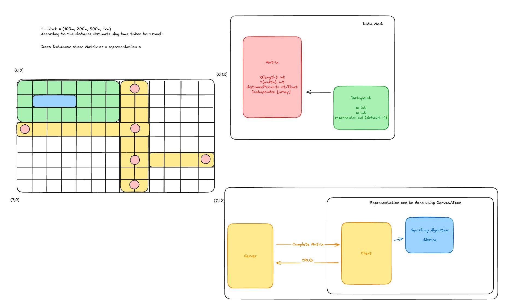

# Smart City Infrastucture (Shortest Path)

## Introduction
This project is a part of the Smart City Infrastructure project. The project is aimed at developing a system that can help in designing and developing a smart city infrastructure. The system will be able to provide the shortest path between two locations in the city.

To find the shortest path between two locations, the system will use the **Dijkstra's algorithm** and **A* algorithm**. 

- The **Dijkstra's algorithm** is a graph search algorithm that solves the single-source shortest path problem for a graph with non-negative edge weights, producing a shortest path tree.
- The **A* algorithm** is a computer algorithm that is widely used in pathfinding and graph traversal. It is an extension of Dijkstra's algorithm with the addition of a heuristic function to improve the efficiency of the search.

### Initial designing of the system 



## Getting Started

### Prerequisites

- Python 3.6 or higher
- pip
- virtualenv
- Django
- Django Rest Framework

### Installation

1. Clone the repository

```bash
git clone https://github.com/Kaushik-Shahare/SmartCityInfrastructure-backend.git
```

2. Create a virtual environment
3. Activate the virtual environment
4. Install the required packages

```bash
pip install -r requirements.txt
```

5. Run the migrations

```bash 
python manage.py migrate
```

6. Run the Django server

```bash
python manage.py runserver
```

## Usage

The system provides a REST API to find the shortest path between two locations in the city. The API provides the following endpoints:

Visit: `http://127.0.0.1:8000/api/map/smart-city/` to access the Main page.

### Create a new map matrix 

#### Request URL
- `{{base_url}}/api/map/matrix/` - Create a new map matrix

#### Request Method
- POST

#### Request Body
```json
{
    "name": "Test",
    "X": 20,
    "Y": 20,
    "distancePerUnit": 500
}

